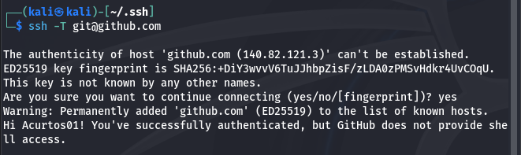

# Unidad 0 - Actividad 3ra5. Git

1. Crear cuenta en GitHub
2. Instalar GIT en nuestro equipo
3. Enlazar cuenta de GitHub con nuestro equipo mediante SSH
4. Comprobar la conexión con GitHub
4. Inicializar un repositorio en nuestro equipo
5. Subir repositorio a GitHub 

## Crear cuenta en GItHub
Accedemos a [GitHub](https://github.com/signup) para crear una cuenta en la plataforma.

Una vez creada veremos un dashboard como este:

## Instalar GIT en nuestro equipo
Comenzamos actualizando los repositorios con el comando `sudo apt update`, continuamos ejecutando `sudo apt install git`. Una vez instalado podemos comprobar su instalación con el comando `git --version` y nos mostrará la versión instalada como se muestra a continuación:

Ahora configuraremos git para que los commits que realicemos están asociados a nuestros datos. Deberemos ejecutar los comandos `git config --global user.name "Adrián Cruto Sánchez"` y `git config --global user.email "acurtos01@iesvjp.es"`.
Comprobaremos que se han actulizados los datos con el comando `git config --list`:

## Enlazar cuenta de GitHub con nuestro equipo mediante SSH
Ahora procedemos a enlazar la cuenta de GitHub con nuestro equipo mediante ssh. Para ello usaremos la guia que nos oferce GitHub en su [documentación](https://docs.github.com/es/authentication/connecting-to-github-with-ssh/generating-a-new-ssh-key-and-adding-it-to-the-ssh-agent).

Abrimos la terminal y ejecutamos el comando `ssh-keygen -t ed25519 -C "your_email@example.com"
` para generar una clave SSH:

En los pasos en los que nos pide que ingresemos un fichero en el que guardar la clave lo omitimos pulsando enter y lo guadará en el fichero por defecto. Para crear la clave tambien pide que intoduzcamos una frase, no es necesario solo es para dar más seguridad, pulsamos enter y termina el proceso de creación de la clave.

Si nos dirigimos a la ruta que nos indica al generar la calve `/home/kali/.ssh` podremos ver que ha generado el fichero `id_ed25519.pub`.

Ahora que hemos localizado donde se encuentra la clave tendremos que copiarla, para mostrarla usaremos el comando `cat id_ed25519.pub`(*la clave se muestra cortada por motivos de seguridad*):

Nos dirigimos a la configuración de GitHub, accedemos a dicha configuración pinchando en la esquina superior derecha de cualquier página en GitHub, haciendo clic en la fotografía de perfil y luego en Configuración. 

En la sección "Acceso" de la barra lateral, haz clic en Claves SSH y GPG.

Pinchamos en Nueva clave SSH o en Agregar clave SSH.

Indicamos un titulo para poder identificar el equipo al que pertenece la clave SSH. Y pegamos la clave en el campo "Clave". Y pinchamos en Agregar clave SSH.

Tras agregar la clave podemos ver que GitHub nos lista la conexión.

## Comprobar la conexión con GitHub

Abrimos la terminal y lanzamos el comando `ssh -T git@github.com`, cuando nos pregunte si deseamos continuar con la conexión le indicamos que si escribiento "yes" y presionado enter. Si se han seguido bien los pasos anteriores nos montrará un mensaje de confirmación conferme hemos establecido una conexión satisfactoria.

## Inicializar un repositorio en nuestro equipo

Inicializamos el respositorio en nuestro equipo con el comando `git init`.

Ahora que se ha incializado el seguimiento de nuestro directorio agragamos los ficheros con `git add .`

Y creamos el primer commit de nuestro directorio con los fireros e indicamos un texto descriptivo `git commit -m "Primer commit"`.

## Subir repositorio a GitHub 

